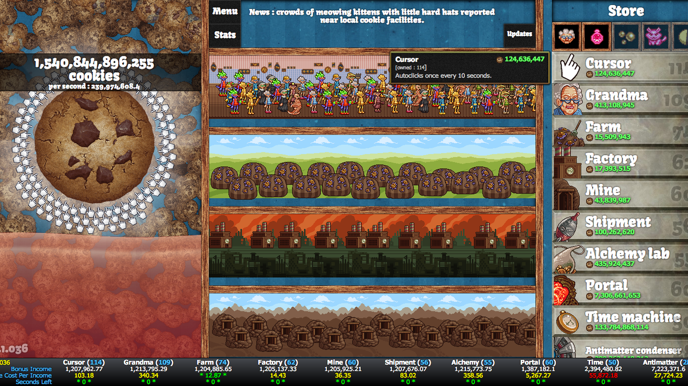
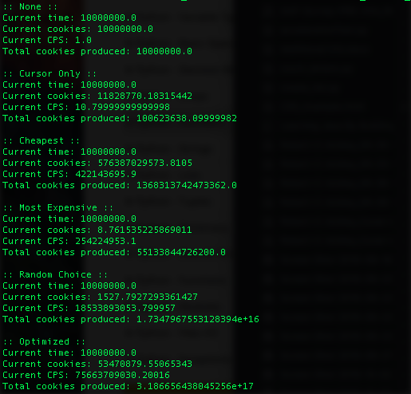

# Cookie Clicker Simulator
A simulator of the Cookie Clicker game with an implementation of an optimized strategy

Cookie Clicker Game:
http://orteil.dashnet.org/cookieclicker/

Cookie Clicker is a web-based incremental (aka idle) game with the goal of producing as many cookies as possible at a time. To start, you simply click the image of the cookie on the left to produce one new cookie per click. As you acquire more cookies, you may spend them on items that produce cookies automatically at increasingly faster rates. Each time you buy an item, the cost of that item increases by 15%. <a href="https://en.wikipedia.org/wiki/Cookie_Clicker">Find out more about Cookie Clicker (Wikipedia)</a>

This project simulates a game of Cookie Clicker and demonstrates the effectiveness of different strategies. For example, one could buy only Cursors. However, since the cost of an item increases with each purchase, it becomes more effective to buy different items. Instead, one could buy the cheapest item as soon as it's available, or only the most expensive item as soon as it can be afforded. While the cheapest strategy yields production increases at a faster rate, both often ignore items that produce greater gains given its cost. In fact, a strategy of simply choosing a random item to save up for and purchase may often outperform any of those mentioned so far. An optimized strategy, however, as implemented here, is to always purchase next the item that produces the most cookies per second per unit cost.

